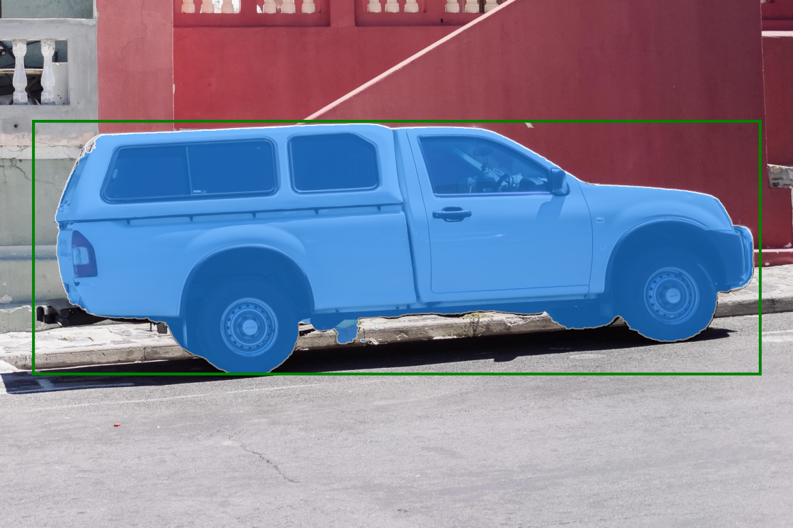
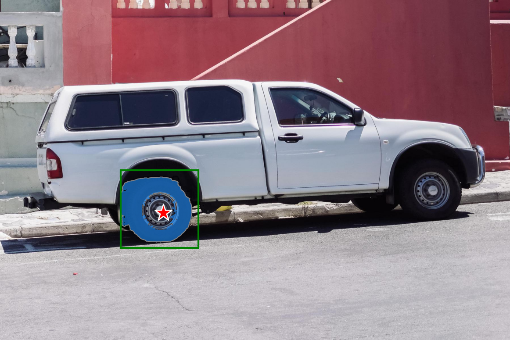

# EdgeTAM
基于EdgeSAM的图像分割Pipeline，支持多种输入提示（框、点、掩码），支持650N系列平台的模型推理。

支持芯片:
- AX650N


支持硬件

  - [M4N-Dock(爱芯派Pro)](https://wiki.sipeed.com/hardware/zh/maixIV/m4ndock/m4ndock.html)
  - [M.2 Accelerator card](https://axcl-docs.readthedocs.io/zh-cn/latest/doc_guide_hardware.html)

原始模型请参考
- [EdgeTAM Github](https://github.com/facebookresearch/EdgeTAM)
- [EdgeTAM Huggingface](https://huggingface.co/facebook/EdgeTAM)

## 性能对比

- 输入图片大小 1024x1024

| Models                | Latency (ms) | CMM Usage (MB) |
| --------------------- | ---------------------- | -------------- |
| edgetam_image_encoder          | 22.348                   | 29.124          |
| edgetam_prompt_encoder           | 0.055                   | 0.023          |
| edgetam_prompt_mask_encoder           | 0.457                   | 0.037          | 
| edgetam_mask_decoder | 4.729                  | 16.730         |

## 模型转换
- 模型转换工具链[Pulsar2](https://huggingface.co/AXERA-TECH/Pulsar2)
- 转换文档见[model_convert/README.md](./model_convert/README.md)

## 环境准备
- NPU Python API: [pyaxengine](https://github.com/AXERA-TECH/pyaxengine)

安装需要的python库
```pip install -r requirements.txt```

## 运行

```bash
(myenv) root@ax650:~/EdgeTAM# python3 image_prediction_ax.py --input_box 75,275,1725,850
[INFO] Available providers:  ['AxEngineExecutionProvider']
Loading EdgeTAM Onnx models...
[INFO] Using provider: AxEngineExecutionProvider
[INFO] Chip type: ChipType.MC50
[INFO] VNPU type: VNPUType.DISABLED
[INFO] Engine version: 2.12.0s
[INFO] Model type: 2 (triple core)
[INFO] Compiler version: 5.0-patch1-dirty a512c95e-dirty
[INFO] Using provider: AxEngineExecutionProvider
[INFO] Model type: 2 (triple core)
[INFO] Compiler version: 5.0-patch1-dirty a512c95e-dirty
[INFO] Using provider: AxEngineExecutionProvider
[INFO] Model type: 2 (triple core)
[INFO] Compiler version: 5.0-patch1-dirty a512c95e-dirty
[INFO] Using provider: AxEngineExecutionProvider
[INFO] Model type: 2 (triple core)
[INFO] Compiler version: 5.0-patch1-dirty a512c95e-dirty
Get prompts:
  input_box: [  75  275 1725  850]
  input_point_coords: None
  input_point_labels: None
Only box input provided
Get dense_embeddings_no_mask
[0.9777304]
✅ Saved: ./results/mask_1.png
```

保存结果在 `./results` 目录下：


```
(myenv) root@ax650:~/EdgeTAM# python3 image_prediction_ax.py --image_path ./examples/images/truck.jpg --input_box 425,600,700,875 --input_point_coords 575,750 --input_point_labels 0
[INFO] Available providers:  ['AxEngineExecutionProvider']
Loading EdgeTAM Onnx models...
[INFO] Using provider: AxEngineExecutionProvider
[INFO] Chip type: ChipType.MC50
[INFO] VNPU type: VNPUType.DISABLED
[INFO] Engine version: 2.12.0s
[INFO] Model type: 2 (triple core)
[INFO] Compiler version: 5.0-patch1-dirty a512c95e-dirty
[INFO] Using provider: AxEngineExecutionProvider
[INFO] Model type: 2 (triple core)
[INFO] Compiler version: 5.0-patch1-dirty a512c95e-dirty
[INFO] Using provider: AxEngineExecutionProvider
[INFO] Model type: 2 (triple core)
[INFO] Compiler version: 5.0-patch1-dirty a512c95e-dirty
[INFO] Using provider: AxEngineExecutionProvider
[INFO] Model type: 2 (triple core)
[INFO] Compiler version: 5.0-patch1-dirty a512c95e-dirty
['575,750']
575,750
Get prompts:
  input_box: [425 600 700 875]
  input_point_coords: [[575 750]]
  input_point_labels: [0]
Get dense_embeddings_no_mask
[0.90291053]
✅ Saved: ./results/mask_1.png

```
